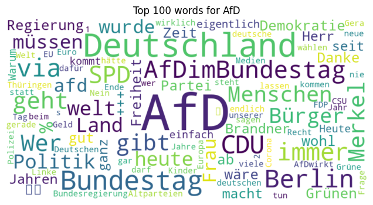

# Predicting the Party Affiliation of German Politicians represented in the [19th session](https://en.wikipedia.org/wiki/List_of_members_of_the_19th_Bundestag) (2017-2021) of the [Bundestag](https://de.wikipedia.org/wiki/Deutscher_Bundestag)

[▶ View the analysis here.](https://github.com/schefflaa/predicting-party-affiliation/blob/main/main.ipynb)

❗ Note that to properly display some images and use intra-document links downloading the repo is necessary.
 
|                                      |                                      |                                    |
| :----------------------------------: | :----------------------------------: | :--------------------------------: |
|               **Linke**              |             **Grüne**                |               **SPD**              |
|  |  |  |
|                 **CDU**              |               **CSU**                |               **FDP**              |
|    |    |  |
|                                      |               **AfD**                |                                    |
|                                      |    |                                    |
