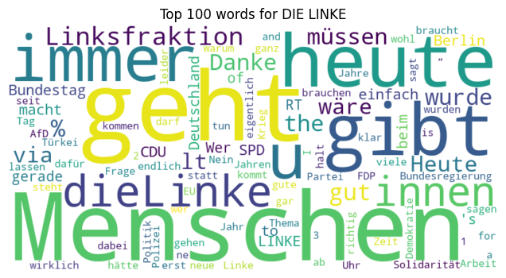
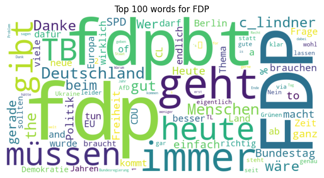

# 🗳️ Predicting German Party Affiliation via Tweets

I used tweets from German politicians of the [19th Bundestag (2017-2021)](https://en.wikipedia.org/wiki/List_of_members_of_the_19th_Bundestag) to predict party affiliation at the tweet level.

### Key Points
- Publishing a [large data set containing ~3 million tweets](https://www.kaggle.com/datasets/schefflaa/predicting-party-affiliation) made by German politicians
- Demonstrating that predicting party affiliation from tweets is possible

[▶ View the analysis here.](https://github.com/schefflaa/predicting-party-affiliation/blob/master/main.ipynb)
 
 

❗ Note that you have to [download the twitter data from kaggle](https://www.kaggle.com/datasets/schefflaa/predicting-party-affiliation) first before running the notebook.
 
|                                      |                                      |                                    |
| :----------------------------------: | :----------------------------------: | :--------------------------------: |
|               **Linke**              |             **Grüne**                |               **SPD**              |
|  |  |  |
|                 **CDU**              |               **AfD**                |               **FDP**              |
|    |    |  |
